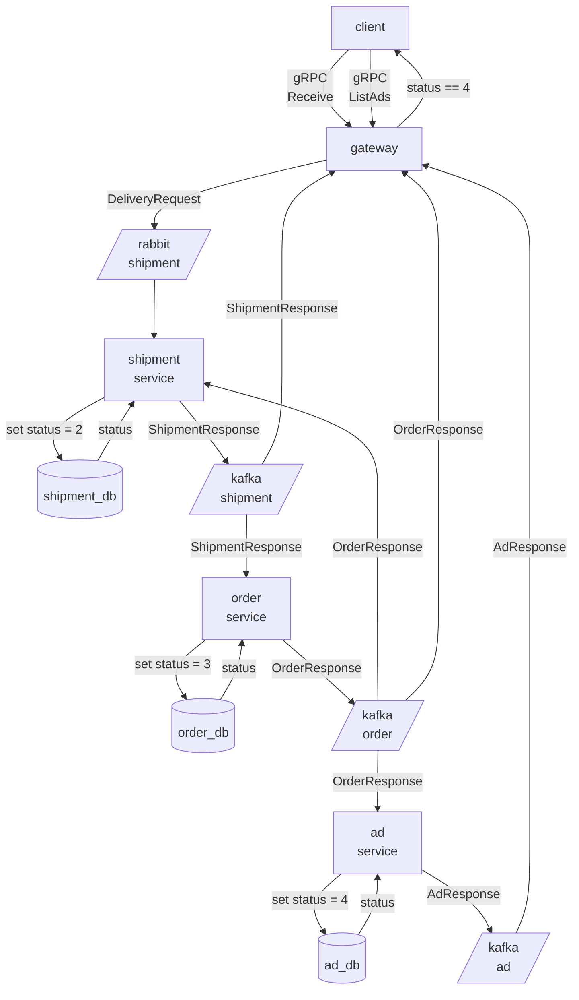

```mermaid
graph TD;
    client -- gRPC<br>Receive --> gateway
    gateway -- DeliveryRequest --> rabbit_shipment[/rabbit<br>shipment/]
    rabbit_shipment --> shipment[shipment<br>service]
    shipment -- set status = 2 --> shipment_db[(shipment_db)]
    shipment_db -- status --> shipment
    shipment -- ShipmentResponse --> kafka_shiping[/kafka<br>shipment/]
    kafka_shiping -- ShipmentResponse --> order[order<br>service]
    order -- set status = 3 --> order_db[(order_db)]
    order_db -- status --> order
    order -- OrderResponse --> kafka_order[/kafka<br>order/]
    kafka_order -- OrderResponse --> ad[ad<br>service]

    kafka_order -- OrderResponse --> shipment
    
    ad -- set status = 4 --> ad_db[(ad_db)]
    ad_db -- status --> ad
    ad -- AdResponse --> kafka_ad[/kafka<br>ad/]
    client -- gRPC<br>ListAds --> gateway
    gateway -- status == 4 --> client
    kafka_shiping -- ShipmentResponse --> gateway
    kafka_order -- OrderResponse --> gateway
    kafka_ad -- AdResponse --> gateway
```